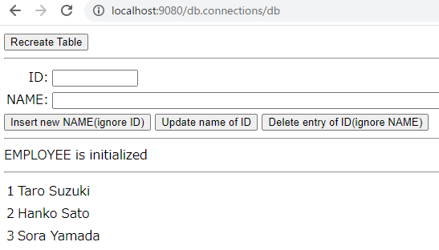
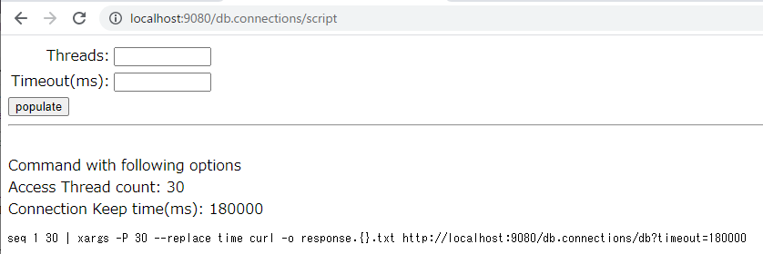

# MustGather Hands-On Sessions Case

## Start db-connections container on docker or openshift

Follow steps described at parent folder's README 


## Access to the servlet to test db operation select/insert/update/dalete

Access to following URL by your browser

- http://localhost:9080/db.connections/db



Please use buttons to test database operation you wanted

You can check that behavior with websphere trace.


## Create scripts to access database by multithreads

Access to following URL by your browser

- http://localhost:9080/db.connections/script



Please us populate button to get scripts with your expected options

Script example
```
seq 1 30 | xargs -P 30 --replace time curl -o response.{}.txt http://localhost:9080/db.connections/db?timeout=180000
```

## Check trace

Please check /logs/trace.log to investigate datasource behavior


## Log example

trace.log example. You can use request url, time and expected sql to find related thread activity.
```
[7/17/21, 13:28:05:365 UTC] 0000002f WSJdbcStateme >  executeQuery Entry
                                 select id,name from EMPLOYEE
[7/17/21, 13:28:05:365 UTC] 0000002f WSJdbcConnect >  beginTransactionIfNecessary Entry
```

Please check other document after you recreate the problem by yourself.
