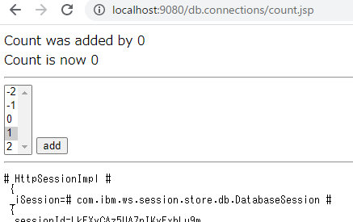

# MustGather Hands-On Sessions Case

## Start db-connections container on docker or openshift

Follow steps described at parent folder's README 


## Access to the servlet to test httpsession

Access to following URL by your browser

- http://localhost:9080/db.connections/count.jsp



When your first access, the httpsession is created.

After you click add button, selected value is added to count attribute in the httpsession

You can check that behavior with websphere trace.

## Check trace

Please check /logs/trace.log to investigate session behavior


## Log example

trace.log example. You can use session id and time to find related thread activity.
```
[7/17/21, 11:25:30:116 UTC] 0000003d WASSessionCor > SessionManager createISession ENTRY id= null
[7/17/21, 11:25:30:116 UTC] 0000003d WASSession    > BackedStore createSession ENTRY id = LkEXyCAz5UA7nIKvFxhLu9m AppName=default_host/db.connections
[7/17/21, 11:25:30:116 UTC] 0000003d WASSession    1 BackedSession  CMVC Version 1.15 8/30/10 10:39:20
[7/17/21, 11:25:30:116 UTC] 0000003d WASSessionCor 1 MemorySession getCreationTime 1626521130116 AppName=default_host/db.connections; Id=LkEXyCAz5UA7nIKvFxhLu9m , _removeAttrOnInvalidate -->false
```

Please check other document after you recreate the problem by yourself.
